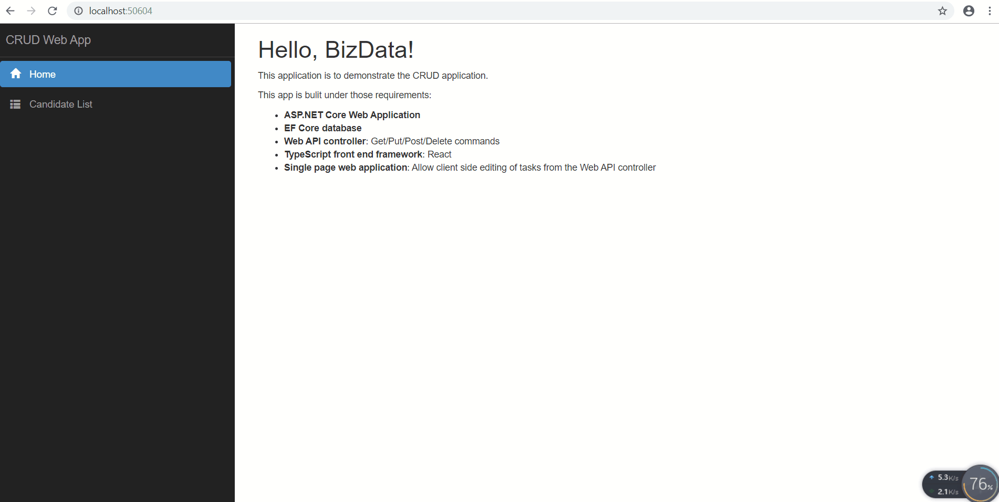

# CRUD Web Application 

This application is to demonstrate the CRUD application allowing user to create, read, update, and delete candidates' information.

## Getting Started

This project is built by EF Core framework. Execute the following script or CRUDDBScript to create the Candidate table:

```SQL
USE [CRUDLocalDB]
GO
/****** Object:  Table [dbo].[Candidate]    Script Date: 9/26/2019 7:41:24 PM ******/
SET ANSI_NULLS ON
GO
SET QUOTED_IDENTIFIER ON
GO
CREATE TABLE [dbo].[Candidate](
	[CandidateID] [int] IDENTITY(1,1) NOT NULL,
	[Name] [varchar](50) NULL,
	[Gender] [varchar](50) NULL,
	[Position] [varchar](50) NULL,
	[Notation] [varchar](50) NULL,
 CONSTRAINT [PK_Candidate] PRIMARY KEY CLUSTERED 
(
	[CandidateID] ASC
)WITH (PAD_INDEX = OFF, STATISTICS_NORECOMPUTE = OFF, IGNORE_DUP_KEY = OFF, ALLOW_ROW_LOCKS = ON, ALLOW_PAGE_LOCKS = ON, OPTIMIZE_FOR_SEQUENTIAL_KEY = OFF) ON [PRIMARY]
) ON [PRIMARY]
GO
```

Under ./Model/CRUDDBContext.cs replace your connection string:

```C#
optionsBuilder.UseSqlServer(@"data source=Your Server Name;initial catalog=CRUDLocalDB;integrated security=True;MultipleActiveResultSets=True;App=EntityFramework");
```

## Structure

* **Models:** CandidateDataAccessLayer.cs to handle database operations under EF Core

* **View:** React typescript --- ./ClientApp

* **WebAPIController:** CandidateController.cs - Web API Controller

## Demo




